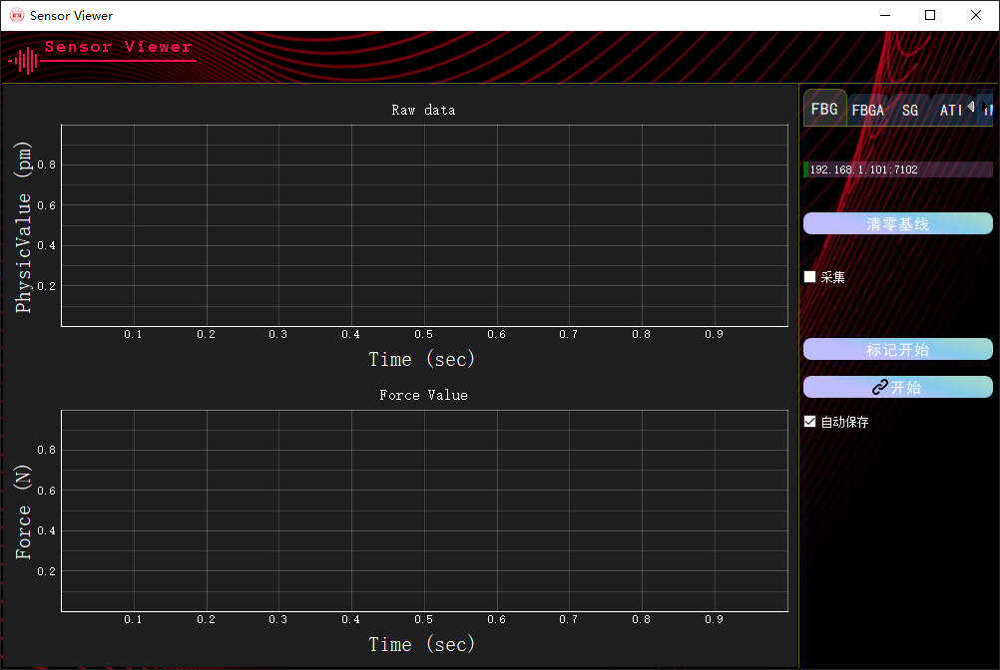

# Sensor Viewer

一个采集多种传感器数据并实时显示的工具。



**支持的传感器：**

- [x] FBG 解调仪
- [x] FBGA 解调仪
- [x] 中诺一维力传感器
- [x] ATI 六维力传感器
- [x] IMU姿态传感器


## 安装

Python版本： python3.8 

### 安装依赖

1. python 包安装：

   ```shell
   pip install -r requirements.txt
   ```

3. 安装qt开发工具：(可选)
    ```shell
    pip install pyqt5-tools
    ```

## 使用

运行`python ui.py` 打开界面
